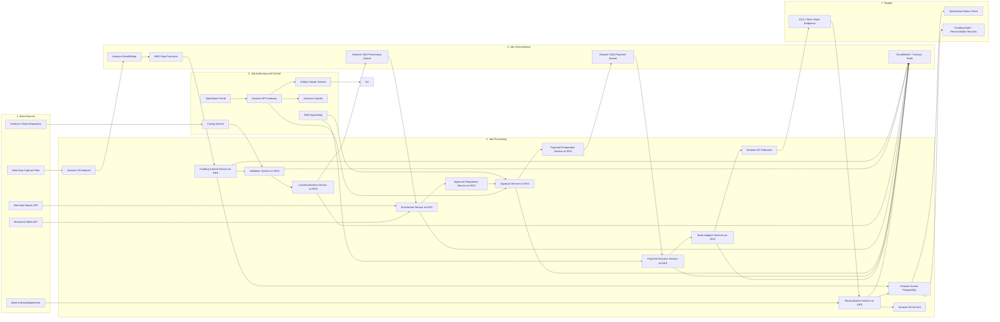
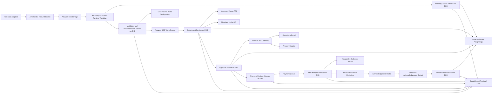

# Funding as a Service Architecture Recommendation

## Problem Summary

ABC needs a resilient global "Funding as a Service" platform that can continue funding merchants even when downstream card scheme clearing and settlement files are delayed. The platform must ingest host data capture files, validate and enrich merchant-level funding records, route them through an approval workflow, generate bank-specific payment files, track acknowledgements, and reconcile each stage through to final merchant funding status.

The design must remain file-driven today while requiring minimal architectural change if the process becomes event-driven later.

## Business Need

- Prevent merchant funding delays caused by upstream settlement disruption.
- Provide operational control over approvals, rejections, and funding visibility.
- Support high-volume, time-bound processing with restartability.
- Build a cloud-native microservices platform on AWS that can scale from 50,000 records to 10 million records.

## System Characteristics

### Functional Characteristics

- File-driven ingestion from host data capture systems.
- Configuration-driven parsing and validation for multiple incoming file formats.
- Canonical internal data model across all internal processing stages.
- API-based enrichment using Merchant Master and Merchant Hotlist services.
- Human approval workflow for merchant funding requests.
- Rules-based payment rail selection, including ACH and wire transfer.
- Bank-specific outbound formatting using an adapter pattern.
- Multi-stage reconciliation using bank acknowledgements and process state.
- File-level and merchant-level operational visibility.

### Non-Functional Characteristics

- Cloud-native, microservices-oriented, horizontally scalable design.
- Restartable workflow from the failed step rather than full-file replay.
- SLA target of 5 minutes for 50,000 records and less than 20 minutes for 10 million records.
- Strong observability for business and technical operations.
- Secure-by-default architecture with encryption, least privilege, and controlled operator access.
- Future compatibility with event-driven processing.

## Recommended Architecture

### Architecture Style

Use an AWS-native batch data processing architecture tailored for funding operations. Align it to the reference template with:

- Data sources on the left
- Authoring and control services across the top
- High-scale processing services in the center
- Orchestration services across the bottom
- Operational and payment targets on the right

Under that structure, use Amazon EKS for domain microservices, AWS Step Functions for durable orchestration, Amazon S3 for file-based exchange and archives, Amazon Aurora PostgreSQL for operational state, and Amazon SQS plus Amazon EventBridge as the asynchronous backbone.

This gives:

- Containerized domain services on EKS.
- Durable orchestration and restartability through Step Functions.
- Elastic parallel processing for large files by splitting them into chunks.
- A clean migration path from file-driven initiation to event-driven initiation.

### Core Design

#### 1. Data Sources and Landing

- Host data capture systems land funding files in an ingestion S3 bucket.
- Merchant Master and Merchant Hotlist APIs provide enrichment data.
- Bank acknowledgements are received through S3 drops or secure endpoints.
- A rules and schema repository stores inbound file schemas, canonical mappings, and outbound bank adapter definitions.
- An S3 event triggers the ingestion workflow through EventBridge.
- API Gateway exposes operator and internal control APIs.
- A Funding Control service on EKS registers the file, stores metadata in Aurora, and starts the orchestration in Step Functions.

#### 2. Job Authoring and Control

- Configuration for inbound parsing, canonical mappings, approval thresholds, payment routing rules, and bank-specific layouts should be versioned and managed separately from application code.
- AWS AppConfig can be used for runtime-managed rules and thresholds.
- Schema, file format, and adapter definitions should be stored in a controlled repository backed by S3 and surfaced through a Config service on EKS.
- This keeps the platform configuration-driven, which is essential for new file formats and new bank integrations.

#### 3. Validation and Canonicalization

- A File Validation service validates schema, header, trailer, and totals.
- A Config service reads file schema definitions and validation rules from versioned configuration storage.
- Valid records are transformed into a canonical funding model.
- Invalid records are quarantined with detailed validation errors for operator review.

#### 4. High-Volume Parallel Processing

- Large files are split into chunks after initial structural validation.
- Validation and canonicalization write chunked canonical artifacts to S3 in Parquet format.
- Aurora stores chunk metadata, status, counts, totals, checksums, and S3 object references.
- Step Functions orchestrates the workflow at file level, while SQS distributes chunk-level work to EKS workers.
- KEDA-based autoscaling on EKS scales workers based on queue depth and processing lag.

#### 5. Enrichment

- An Enrichment service calls Merchant Master and Merchant Hotlist APIs.
- Workers read canonical chunk artifacts from S3, enrich them, and write enriched Parquet chunk artifacts back to S3.
- Aurora is updated with stage completion and chunk-level reconciliation metadata.
- Response caching can be added with ElastiCache where merchant lookup volume is high and data freshness rules permit it.

#### 6. Approval Workflow

- Approval is a file-level business checkpoint, not a chunk-level checkpoint.
- When all enrichment chunks for a file complete, an Approval Preparation service builds a file-level approval manifest and summary from the chunk outputs stored in S3.
- The manifest references the S3 Parquet objects and materializes approval-facing summary and record state in Aurora.
- Operators authenticate through Amazon Cognito and access the portal via API Gateway.
- The Approval service shows the file as the primary approval unit while allowing drill-down to individual merchant records.
- Users can approve the file, or reject selected records within the file.
- Approval decisions are persisted in Aurora, and only approved records move to payment processing.

#### 7. Artifact Viewer and Diagnostic Support

- Because intermediate artifacts are stored in Parquet for throughput and storage efficiency, an Artifact Viewer service is required for operational inspection.
- The Artifact Viewer service reads Parquet artifacts from S3, deserializes them, and exposes human-readable record views, pagination, filters, and failure diagnostics.
- Failed chunks can optionally produce a small diagnostic export in JSON or CSV for rapid support analysis without duplicating all intermediate storage in text form.

#### 8. Payment Routing and Bank Adapters

- A Payment Preparation service reads the approved-record set for a file from the approval output and groups records by rail and beneficiary bank.
- A Payment Decision service applies routing rules, such as wire transfer for requests above the configured threshold and ACH otherwise.
- A Bank Adapter framework formats outbound files per beneficiary bank schema while preserving the canonical internal model.
- Outbound payment files are generated in text formats required by the destination banks, written to secure S3 locations, and transmitted by bank connector services running on EKS.

#### 9. Acknowledgement and Reconciliation

- Bank acknowledgements are ingested through S3 or secure integration endpoints.
- A Reconciliation service compares:
  - source file totals,
  - approved merchant totals,
  - sent payment totals,
  - acknowledgement totals,
  - final funded merchant totals.
- Reconciliation status is maintained at both file and merchant level.

#### 10. Orchestration, Observability, and Audit

- EventBridge handles event publication for audit, notifications, and future extensibility.
- Step Functions remains the primary orchestrator at file level: start file processing, wait for all chunk completions, trigger approval preparation, wait for approval completion, trigger payment preparation, and drive reconciliation checkpoints.
- SQS buffers chunk-level work and isolates spikes between processing stages.
- CloudWatch Logs, metrics, and alarms capture technical health.
- Prometheus and Grafana on EKS can provide service-level dashboards if deeper runtime visibility is needed.
- AWS X-Ray or OpenTelemetry tracing should be enabled for API and service flows.
- Business audit trails for approvals, rejections, funding decisions, and bank acknowledgements are persisted in Aurora and archived to S3.

### Why This Fits the Requirement

- It is file-driven today, but EventBridge plus SQS introduces an event backbone that allows future event-driven initiation without redesigning the processing domains.
- Step Functions provides restartability and controlled progression at file level while preserving high-parallel chunk execution under SQS-driven workers.
- EKS provides the microservices runtime explicitly requested and supports horizontal scale-out.
- S3 plus Parquet-based chunk processing supports very large file volumes with efficient storage and transfer.
- Aurora stores operational state, file and chunk status, approvals, reconciliation results, searchable status views, and approval-facing record state.
- Adapter and configuration-driven patterns address multiple inbound and outbound file formats.

## AWS Service Mapping

- `Amazon S3`: inbound files, outbound files, acknowledgements, archived artifacts
- `Amazon EventBridge`: workflow initiation events and future event-driven extensibility
- `AWS Step Functions`: end-to-end orchestration and restartable state management
- `Amazon EKS`: domain microservices and worker services
- `Amazon SQS`: buffering and decoupling between processing stages
- `Amazon Aurora PostgreSQL`: transactional state, approvals, reconciliation, audit, operational queries
- `Amazon API Gateway`: operator and internal APIs
- `Amazon Cognito`: operator authentication and access control
- `AWS AppConfig`: runtime-managed thresholds, approval policies, routing rules
- `Amazon S3 Select or custom viewer services`: optional inspection support for intermediate artifacts
- `AWS Secrets Manager`: API credentials, bank integration secrets
- `AWS KMS`: encryption key management
- `Amazon CloudWatch`: logs, alarms, dashboards
- `AWS X-Ray` or `OpenTelemetry`: distributed tracing
- `AWS WAF`: edge protection for operator-facing endpoints

## Processing Flow

1. Host system uploads funding file to S3.
2. S3 event triggers EventBridge, which starts the funding workflow.
3. Funding Control service registers the file and initializes state in Aurora.
4. Validation service validates structure and schema using configuration metadata.
5. File is chunked and transformed into canonical Parquet artifacts in S3.
6. Parallel enrichment workers read chunks from S3, call Merchant Master and Hotlist APIs, and write enriched Parquet artifacts back to S3.
7. When all chunks finish, Approval Preparation builds a file-level approval manifest and approval dataset.
8. Operators review the file in the approval UI and approve the file or reject selected records.
9. Payment Preparation and Bank Adapter services generate and transmit bank-specific text files for approved records.
10. Acknowledgements are ingested and matched.
11. Reconciliation service confirms funding status at file and merchant level.

## Security Architecture

- Run EKS worker nodes and Aurora in private subnets.
- Use API Gateway, WAF, and Cognito for operator-facing access.
- Encrypt data at rest using KMS for S3, Aurora, and secrets.
- Encrypt data in transit with TLS for all APIs and bank integrations.
- Use IAM roles for service-to-service access rather than static credentials.
- Store bank credentials, API tokens, and certificates in Secrets Manager.
- Maintain immutable audit trails for approvals and payment file generation.

## Scalability and Performance Approach

- Split files into chunks and process them in parallel.
- Scale EKS workers horizontally using queue depth and CPU/memory thresholds.
- Use Parquet for intermediate S3 artifacts to reduce storage footprint and improve scan efficiency over verbose text formats.
- Use asynchronous inter-service boundaries for high-volume chunk stages.
- Optimize Aurora usage for metadata, workflow state, approval state, and operator-facing summaries, not raw pipeline payload storage.
- Store large intermediate artifacts in S3 rather than the relational database.
- Use idempotent processing keys at file, chunk, and merchant level to support retries safely.

## Restartability Strategy

- Track execution state per file, chunk, and merchant batch in Aurora.
- Persist Step Functions execution context and checkpoint outcomes after each stage.
- Retry transient failures automatically.
- Route non-transient failures to an operational exception queue and allow replay from the last successful stage.
- Keep validation, enrichment, approval preparation, approval, payment formatting, and reconciliation as independently restartable steps.

## Future Event-Driven Evolution

The recommended architecture should be implemented with domain events from the start, even though ingestion begins with files. Key state changes such as `FileValidated`, `ChunkEnriched`, `ApprovalReady`, `FundingApproved`, `PaymentFileGenerated`, and `BankAcknowledged` should be emitted through EventBridge for audit, observability, and future consumers. The critical funding path should still remain Step Functions-orchestrated at file level rather than pure event choreography.

## Architecture Decisions

### ADR-01: Use EKS for Domain Services

**Problem**  
The platform must be cloud-native, microservices-based, and capable of horizontal scale with varied processing workloads.

**Options Considered**  
- AWS Lambda
- Amazon ECS
- Amazon EKS

**Recommended Option**  
Amazon EKS

**Reason**  
EKS best fits the explicit microservices requirement, long-running workers, adapter services, custom runtime control, and high-throughput batch-style workloads.

### ADR-02: Use Step Functions for File-Level Workflow Orchestration

**Problem**  
The process is multi-stage, stateful, restartable, operationally sensitive, and includes a file-level approval checkpoint.

**Options Considered**  
- Custom orchestration service
- Pure event choreography
- File-level orchestration with AWS Step Functions and chunk-level worker queues

**Recommended Option**  
File-level orchestration with AWS Step Functions and chunk-level worker queues

**Reason**  
Step Functions should orchestrate the lifecycle of a file: register, validate, wait for all chunk enrichments to complete, trigger approval preparation, wait for approval completion, initiate payment preparation, and drive reconciliation checkpoints. Chunk execution should remain queue-driven for scale, but business progression across stages should stay under a central file-level orchestrator.

### ADR-03: Use Canonical Data Model Internally

**Problem**  
Inbound and outbound file formats vary, and point-to-point transformations will become unmaintainable.

**Options Considered**  
- Direct format-to-format mapping
- Canonical internal model with adapters

**Recommended Option**  
Canonical internal model with adapters

**Reason**  
This reduces coupling, isolates bank-specific and source-specific schemas, and makes the future move to event-driven processing simpler.

### ADR-04: Use S3-Backed Parquet Chunk Artifacts for Scale

**Problem**  
The system must process up to 10 million records within tight elapsed time targets without turning Aurora into a bulk-payload bottleneck.

**Options Considered**  
- Single-threaded sequential file processing
- Database-centric intermediate storage
- S3-backed chunking with text artifacts
- S3-backed chunking with Parquet artifacts and distributed workers

**Recommended Option**  
S3-backed chunking with Parquet artifacts and distributed workers

**Reason**  
Chunking allows broad horizontal parallelism, supports retry at smaller units of work, and avoids using Aurora as a bulk payload engine. Parquet reduces intermediate storage size, improves scan efficiency, and is a better fit than verbose text for high-volume internal processing. Aurora should store only workflow metadata, approval state, and operator-facing summaries plus references to the S3 artifacts.

### ADR-05: Use EventBridge and SQS from Day One

**Problem**  
The current process is file-driven, but the target architecture must evolve to event-driven with minimal change.

**Options Considered**  
- Pure synchronous microservices
- Step Functions only
- Event backbone with EventBridge and SQS

**Recommended Option**  
Event backbone with EventBridge and SQS

**Reason**  
This preserves the current file-driven entry point while establishing decoupled stage boundaries that support future event-native flows.

### ADR-06: Add an Artifact Viewer for Intermediate Data Inspection

**Problem**  
Efficient binary or columnar intermediate artifacts improve throughput, but they are harder for operators and support teams to inspect during failures or approvals.

**Options Considered**  
- Store all intermediate artifacts as human-readable text
- Require engineers to decode artifacts manually from S3
- Store efficient intermediate artifacts and provide a dedicated viewer

**Recommended Option**  
Store efficient intermediate artifacts and provide a dedicated viewer

**Reason**  
Parquet is the right default for internal throughput and storage efficiency, but operational support still needs record-level visibility. A viewer service closes that gap without forcing the core pipeline to store all intermediate data in inefficient text formats.

## Reference-Aligned AWS Diagram

The following diagram is intentionally structured to mirror the batch data processing reference architecture template you provided: sources on the left, authoring/control on top, processing in the middle, orchestration at the bottom, and targets on the right.

## Mermaid Diagram

## Recommended Next Steps

1. Confirm the approval operating model, including maker-checker rules and segregation of duties.
2. Define the canonical funding data model and schema versioning approach.
3. Classify banks and payment rails to design the first adapter set.
4. Baseline performance with representative files and chunk-sizing strategy.
5. Decide whether reconciliation should be near-real-time or settlement-window driven.
